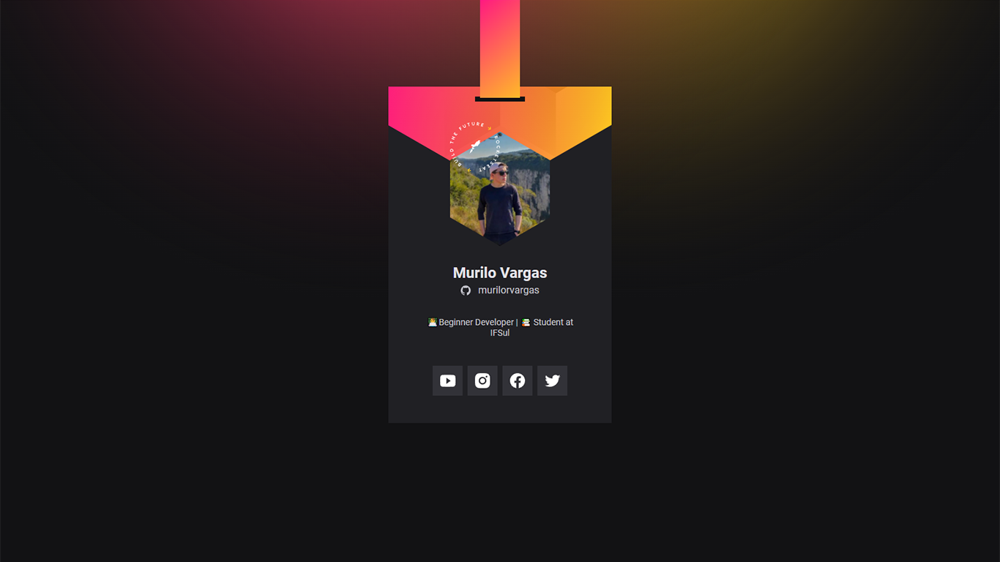

<h1 align="center">
  DoWhile Virtual Badge
</h1>

  <a href="#-tecnologias">Technologies</a>&nbsp;&nbsp;&nbsp;|&nbsp;&nbsp;&nbsp;
  <a href="#-project">Project</a>&nbsp;&nbsp;&nbsp;|&nbsp;&nbsp;&nbsp;
  <a href="#memo-license">License</a>

  
  
  

  

 

  

## 🚀 Technologies

The following tools were used in this project:

- HTML
- CSS
- JavaScript

## 💻 Project

DoWhile Virtual Badge is a static application with the objective of showing the user information brought from the GitHub API and inserting it in a layout with the face of the DoWhile 2021 event.

## :memo: License

This project is under license from MIT. For more details, see the [LICENSE](LICENSE) file.
